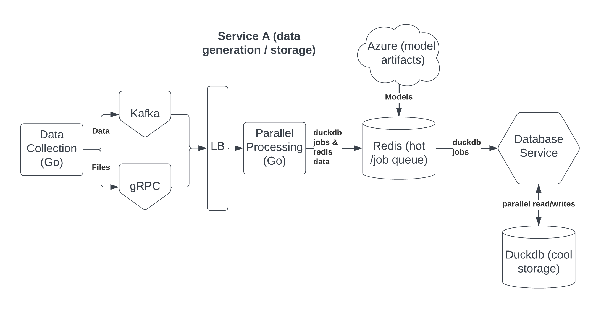
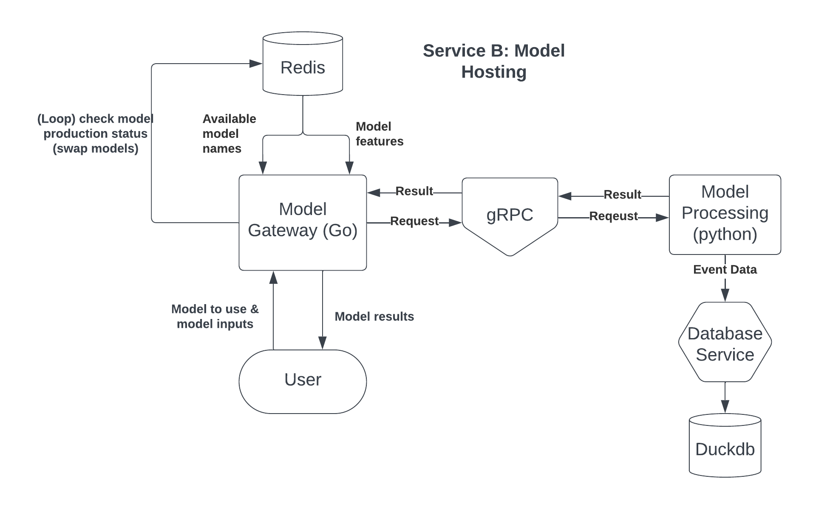
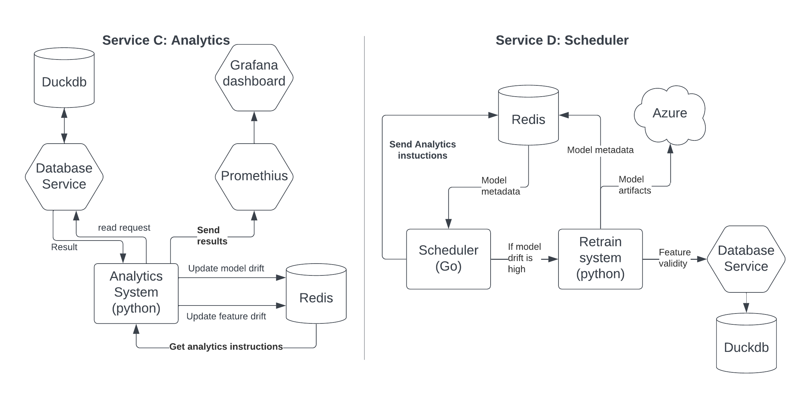

A Distributed AI Infrastructure Platform (Feature Store + Model Serving + Drift Monitoring + Batch/Streaming Pipelines)

# Summary
This is a scaled-down version of common enterprise ML infrastructure programs. Companies use this type of setup to host multiple ML models and auto-handle all their data gathering, logging, maintenance, metrics, dashboard, database, etc. There's no ML in this; it's purely everything an ML model needs to succeed.

Inspired by Uber Michelangelo (YouTube link) https://www.youtube.com/watch?v=KJe8_FLMRx4&t=435s

**What Does it Solve / Why Build It?**
It solves ML reliability. It guarantees that models always use fresh, correct, and consistent data, are monitored for degradation, can be deployed safely, and can scale horizontally. Basically, it makes machine learning production-ready.

**Core Tech Used**: Go, Python, gRPC, Kafka, Docker, Redis, DuckDB, Prometheus, Grafana
**Core Ideas Used**: Distributed systems, horizontal scaling, load balancing, data pipelines, hot/cool feature stores, drift detection, microservices architecture, concurrency

# Architecture
**Startup** (before any service starts): Start Docker, which hosts Redis, Prometheus, and Grafana; start the database service, check for database tables and data, look in Azure for which models are production-ready and download their artifacts into Redis (so we can quickly access production models). We also load model metadata into Redis (including what features each model uses). Start Kafka server. We then start the 4 other services in Go routines.

**Database service:** All services call this service to handle DuckDB read/writes. DuckDB is easy to file lock, so services send their DuckDB requests to a Redis job queue, then the database service reads that queue, processes them, and sends the results to Redis with the corresponding job key.

**Service A - data gathering:** A Go file generates random JSON data and random JSON/Parquet files.
- Random data: It's batched into Kafka, and when Kafka fills, it sends it to a processing file (Go) that cleans it, sends the critical data to Redis, and sends all data to DuckDB.
- Data files: Sent to the data processing file via gRPC. This data is stored in DuckDB.
- Data processing file: Uses load balancing to process the Kafka and gRPC data via Go routines and Python workers.

**Service B - model hosting:** We already loaded all production model artifacts into Redis at startup. Now we ask the user which model they want to use, then we retrieve the required model feature names from Redis and ask the user for them. We send the request over gRPC to a Python sub-process that runs the model and returns the results. We log this whole interaction to DuckDB. This can host any number of models. This also checks which models are in production status every few minutes since Service D can swap models around.

**Service C - metrics:** This is called on a schedule (done by Service D) to run non-blocking statistical tests. We group data from DuckDB and logs into time period "buckets" and run tests like KS-Test, PSI, and KL Divergence to find drift in the model performance or drift in features compared to current data. This drift basically shows if the model or features are degrading in quality. We push results to Redis, and those results are scanned by Service D, which triggers the necessary reactions. Python workers do the heavy work and expose the results to a /metrics page that Prometheus scrapes. Then, Grafana queries Prometheus to update the Grafana dashboard to show metrics. We now have a UI that shows all metrics for all models.

**Service D - system automation:** This service builds the models that Service B serves the user, pushes new model artifacts to Azure, and updates model production status/metadata to Redis, DuckDB, and Azure. It also handles the scheduling for when Service C does analytics. We check Redis for the Service C results, which triggers the other features. This can retrain models if needed and push their artifacts to Azure.
- This means Service B (which checks for model updates on a schedule) will swap out models by itself.
- This controls Service C.

## Flow Charts

# Database Decisions
ISSUE: DuckDB can only handle 1 writer at a time but all services need to read/write to it.

SOLUTION: Because this is all locally running, but it's still 4 independent services, I need 1 database service just for DuckDB.

- DuckDB (cool data): All non-model artifact data gets stored here. We use the appender API for concurrent writes.
- Azure: Only model artifacts get stored here.
- Redis (hot data): Only critical data that's accessed often or needs low latency gets stored here, as well as DuckDB job requests for the database service. ex) production model artifacts/metadata.

# Concurrency Decisions
ISSUE: How do I handle so many Python workers and Go routines? Multiple services need concurrency and processing. Assume across all services I have 100 Go routines and 12 Python workers all needing to run at the same time.

SOLUTION: Set a max_python_workers variable and have a load balancer (which includes CPU considerations) that assigns jobs to Go routines vs Python workers. This will eat through a job queue as fast as possible without crashing the system and won't allocate more threads if a super CPU-heavy task is running.
- Go routines: they're super lightweight and I can run 10,000 with no issues. The reason they're so lightweight is because they only grow in resource consumption as needed and aren't managed by the OS. Also, swapping between routines is crazy fast by omitting the OS. It does other things too that let it scale to thousands of routines.
- Python workers: these use an actual CPU thread, and each worker might load in libraries which can eat RAM. But they're needed for high processing tasks like large file uploads and retraining models.

# Future Feature Considerations
1) This does not give weights to jobs. So Service D training might use all workers, which is the lowest priority. Service A should be able to stop some Service D workers, for example, so I can work the bulk of the platform.

2) C++ memory management layer
    - goals: more experience with C++
    - stuff like this benefits a lot from memory management at scale

3) Cache common DuckDB queries in Redis, like "get user profile". That would be faster.

4) Right now I send DuckDB read/write requests to Redis which the db handler service sees. This is poor design.

7) The model server is slightly poorly designed. I have to run the Python script separately from the program (just once, but it's still a startup cost and likely wastes resources for the program). We can get around this by rewriting it so Python is a child of the Go process. However, on investigation of that fix, it seems like a fragile band-aid solution. I don't trust it.